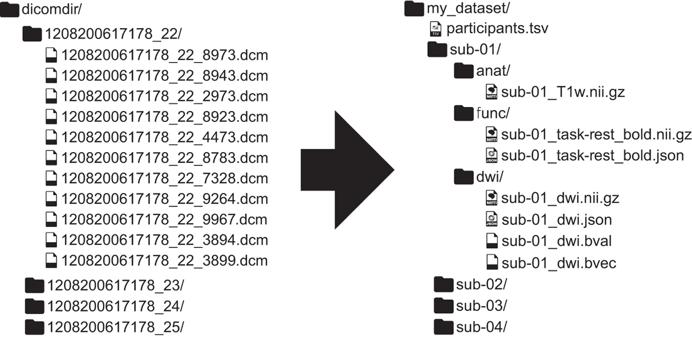

==================
Data structure
==================

Neuroimaging experiments generate a complex set of data that can be organized in many different ways. 
For many years, the research community has been trying to find a way to effectively store and manage the data collected 
from the fMRI scanner.  

Brain Imaging Data Structure
-----------------------------

*Brain Imaging Data Structure* (**BIDS**) was originally designed to describe and apply consistent naming conventions to raw data 
(`Gorgolewski et al., 2016 <https://www.nature.com/articles/sdata201644>`_). 

**Derivatives** of the raw data (other than products of DICOM to NIfTI conversion) MUST be stored separately from the raw data to protect 
the raw data from accidental changes.

Structuring your data according BIDS also enables to use automatic analysis tools such as `fMRIPrep <https://fmriprep.org/en/stable/>`_ or other `BIDS Apps <https://bids-apps.neuroimaging.io/apps/>`_.

--------------------------------------------

*Figure 1.* From unstructured data (*left*) to a BIDS-structured dataset (*right*). 

To understand the organization of files and their format, refer to the `BIDS documentation <https://bids-specification.readthedocs.io/en/stable/02-common-principles.html>`_.

Create a BIDS compatible dataset 
---------------------------------

Here we summarize the steps necessary to create a BIDS-compatible dataset as described by `Gorgolewski et al., 2016 <https://www.nature.com/articles/sdata201644>`_.

1. **Convert DICOM files to NIfTI**

Data collected with an fMRI scanner are initially stored in DICOM format. 
In the first step, we have to convert our data from DICOM to NIfTI format. 

.. seealso:: To perform such file conversion, we recommend using `dcm2niix format <https://github.com/rordenlab/dcm2niix>`_, which is an open-source software that runs on macOS, Linux, and Windows, typically without requiring any third-party dependencies. At the bottom of the documentation available on GitHub, you can find other linked alternatives, e.g. `HeuDiConv <https://github.com/nipy/heudiconv>`_ which may facilitate the process of creating BIDS validate datasets and additionaly, this converter does integrate with DataLad by placing converted and original data under git/git-annex version control system.
 
2. **Create folder structure**

BIDS relies on a particular folder structure and naming scheme of files. 
We start with creating the folder structure with one folder for each participant named ‘sub-01’, ‘sub-02’ and so on. 
When we have multiple scanning sessions, as in longitudinal fMRI studies, each subject subfolder should contain a 'ses-<label>' subfolder, where label coresponds to the ID of a session.
Inside each subject/session folder, we create subfolders such as: ‘anat’ for anatomical scans, ‘dwi’ (for diffusion scans),‘func’ (for task fMRI) and ‘fmap’ for field mapping. 
After creating the base folder structure, we have to move specific scans to an accurate folders and rename it.

3. **Rename files**

Besides organizing your folders, you have to change names of your neuroimaging data files (.nii.gz) according to BIDS convention.  

* When data have been collected in several sessions for each subject, the name of the filename must start with the string ``sub-<label>_ses-<label>``.

* If the session level is omitted from the folder structure, the filename must begin with the ``sub-<label>``, without the ``ses-<label>``.

``sub-<label>`` corresponds to an entity, where ``<label>`` corresponds to that entity's unique identifier, for example *01*. The same goes for a session entity with its ``ses-`` key and ``<label>`` value.

::

    sub-01
        ∟ anat 
         #data type
           ∟ sub-01_run-01_Tww.nii.gz
            #entities, suffix and exntension

Every folder and file name has to be renamed following the BIDS standard. 
See more information `here <https://github.com/bids-standard/bids-starter-kit/wiki/The-BIDS-folder-hierarchy>`_.

4. **Add remaining data**

We need to provide details on the experimental paradigm for modality-specific files. To see possibilities, 
`go here <https://bids-specification.readthedocs.io/en/stable/04-modality-specific-files/01-magnetic-resonance-imaging-data.html>`__.

BIDS aspires to describe a majority of datasets, but acknowledges that there will be cases that do not fit the present version of BIDS. 

5. **Add missing metadata**

You have to provide the name of each task, but it is optional to add information such as task instructions and description. 
Also, it is recommended to include external ontology such as `Cognitive Atlas <https://www.cognitiveatlas.org/>`_ or 
`Cognitive Paradigm Ontology <http://www.cogpo.org/>`_ to clarify research purposes.  

6. **Validate the dataset**

**BIDS Validator** has been developed to easily check whether a dataset accurately follows the BIDS standard. 
Once the dataset is organized into BIDS format, 
the BIDS Validator can be used to check if any of the required or recommended metadata are missing.

.. note:: We recommend using the Web version of BIDS validator with no need to install additional software. To validate your data:
    
    * Open Google Chrome or Mozilla Firefox (the only supported browsers).

    * Go to `BIDS Validator <https://bids-standard.github.io/bids-validator/>`_ and select a folder with BIDS dataset.

    * If the validator seems to work longer than a couple of minutes, open developer tools and report the error in the `designated place <https://github.com/bids-standard/bids-validator/issues>`_.

The BIDS validator performs the validation on the client side (no data is uploaded or shared) 
so it is suitable for sensitive datasets that are not intended to be publicly shared. 
