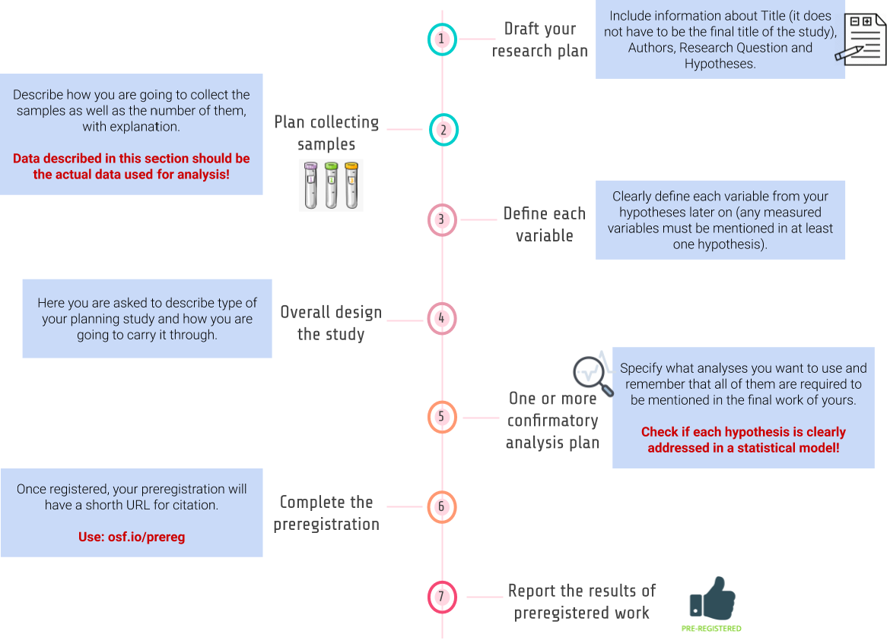

.. reproducible-neuroimaging documentation master file, created by
   sphinx-quickstart on Tue Aug  4 15:25:55 2020.
   You can adapt this file completely to your liking, but it should at least
   contain the root `toctree` directive.
   
----------------
Preregistration
----------------

**Preregistration** is the practice of registering research plan before they are conducted. The preregistered report format requires reseachers to submit a description of the confirmatory hypotheses, variables, study methods and analysis plan prior to data collection. This practice allows researchers to circumvent the publication bias toward significant findings and prevent the data from taking you hostage. Preregistration makes the distinction between hypothesis testing and exploratory (hypothesis generating) research more clear. Data set won’t affect hypothesis and vice versa. 

`Click here <https://osf.io/e6auq/wiki/Example%20Preregistrations/?view>`_ to see some examples of preregistrations segregated by discipline and study type.

==================

-------------------------
Types of preregistration
-------------------------

1. Unreviewed

*Unreviewed registration report* contains detailed description of researcher’s plans for a study as possible, and researcher saves those plans in a time-stamped, uneditable archive; can be shared with reviewers, editors, and other researchers. 

2. Reviewed

In *reviewed registration report* researcher submits a detailed proposal for a study to a journal before conducting the study (these registered reports have the same virtues as preregistration, but they also address the problem of publication bias because the studies are published regardless of their outcomes!); proposed study will be informative regardless of its outcome.

3. RRR - Registered Replication Reports

In *registered replication reports* researchers direct replication of one or more original findings. Many labs follow the same preregistered plan, and the results from all of those independent studies are published collectively regardless of the outcomes of individual studies. 

------------------------------
How to make a preregistration? 
------------------------------

Follow a template from Open Science Framework at `Word <https://osf.io/jea94/>`_ / `GoogleDocs <http://bit.ly/preregtemplate>`_ or `AsPredicted <https://aspredicted.org/create.php>`_ and fill it with your own research ideas.

-------------------------
Rules of preregistration
-------------------------

1. Once registered, your preregistration will have a short URL for citation. **Remember to include a link to your registration report**.

2. **Report the results of ALL preregistered analyses regardless of outcome**.  

3. **ANY unregistered analyses must be transparently reported as exploratory finding** Do not stop yourself before make transparent changes to analysis plan but remember to report the change and its justification (it have to be reported somehow as intuitive suggestions).

------------------------------------------
Why all researchers should preregistrate?
------------------------------------------

.. image:: img/seven_selfish_reasons.jpg
  :width: 400
  :align: center
  :alt: Alternative text

`Source link <https://www.psychologicalscience.org/observer/seven-selfish-reasons-for-preregistration#.WRMdbLzyvgF>`_
  