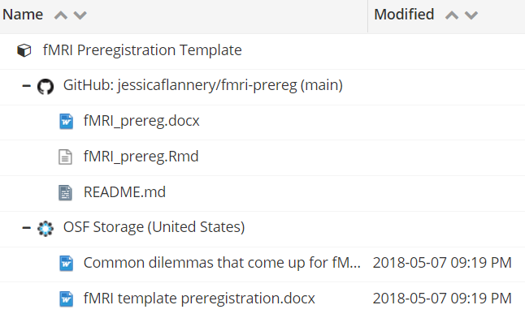

.. reproducible-neuroimaging documentation master file, created by
   sphinx-quickstart on Tue Aug  4 15:25:55 2020.
   You can adapt this file completely to your liking, but it should at least
   contain the root `toctree` directive.

Preregistration
======================

**Preregistration** is the practice of registering your detailed research plan before conducting a study.
The **preregistered report** format requires researchers to submit a description of the confirmatory hypotheses,
variables, study methods, and analysis plan prior to data collection.
This practice allows researchers to circumvent the publication bias toward significant
findings and prevent the data from taking you hostage.
Preregistration also makes the distinction between hypothesis testing and exploratory (hypothesis generating) research more clear. As a result, the obtained results won’t affect the hypothesis and vice versa.

**Preregistration** is the practice of registering research plan before it is conducted. The preregistered report format requires reseachers to submit a description of the confirmatory hypotheses, variables, study methods and analysis plan prior to data collection. This practice allows researchers to circumvent the publication bias toward significant findings and prevent the data from taking you hostage. Preregistration makes the distinction between hypothesis testing and exploratory (hypothesis generating) research more clear. Data set won’t affect hypothesis and vice versa. 

`Click here <https://osf.io/e6auq/wiki/Example%20Preregistrations/?view>`_
to see some examples of preregistrations segregated by discipline and study type.

Types of preregistration
-------------------------

1. **Unreviewed registration report** - contains a detailed description of the researcher’s plans for a study as possible,
   and the researcher saves those plans in a time-stamped, uneditable archive;
   can be shared with reviewers, editors, and other researchers.

2. **Reviewed registration report** - researcher submits a detailed proposal
   for a study to a journal before conducting the study.
   Reviewed registration reports have the same virtues as preregistration,
   but they also address the problem of publication bias: results of the study are published regardless of their outcomes.

3. **Registered replication reports (RRR)** - researchers conduct replication of one or more original findings.
   Many labs follow the same preregistered plan, and the results from all of these independent studies are published
   collectively regardless of the outcomes of individual studies.

How to make a preregistration? 
------------------------------

Follow a template from *Open Science Framework* at `Word <https://osf.io/jea94/>`_ / `GoogleDocs <http://bit.ly/preregtemplate>`_
or `AsPredicted <https://aspredicted.org/create.php>`_ and fill it with your own research ideas.
Open Science Framework allows to follow a simple template at  `Word <https://osf.io/jea94/>`_ / `GoogleDocs <http://bit.ly/preregtemplate>`_ or you can use another site:  `AsPredicted <https://aspredicted.org/create.php>`_ and fill it with your own research ideas.

To illustrate the preregistration process, we created a simple example of the whole process:

.. image:: img/how_to_prereg.png
   :align: center
   :alt: Alternative text

Template for fMRI research preregistration
-------------------------------------------

To be more specific and for the purposes of this documentation, we extract a **preregistration report specifiaclly for fMRI research**, by `clicking here <https://osf.io/6juft/>`_ (Flannery, 2020).

   
Any solution put in following template selected by the author is a suggestion of practices for reported fMRI methos put forth by Nichols et al., 2016 & Poldrack et al., 2008. The whole documentation is available on GitHub so everyone can contribute and improve the whole statement.

Rules of preregistration
-------------------------

1. Once registered, your preregistration will have a short URL for citation.
   **Remember to include a link to your registration report**.

2. **Report the results of ALL preregistered analyses regardless of outcome**.  

3. **ANY unregistered analyses must be transparently reported as exploratory finding.**
   Do not stop yourself before make transparent changes to analysis plan
   but remember to report the change and its substantive justification.

Why all researchers should preregister their studies?
---------------------------------------------------------

In 2016, Eric-Jan Wagenmakers and Gilles Dutilh published the
`article <https://www.psychologicalscience.org/observer/seven-selfish-reasons-for-preregistration>`_
where they highlight the personal benefits of pre-registration for increasing the potential of success in an academic career.
In the paper, authors presented *seven selfish reasons for preregistration*. In particular, that reasons included:

.. image:: img/seven_selfish_reasons.jpg
  :width: 400
  :align: center
  :alt: Alternative text

1. **Preregistration allows you to get credit for having been able to anticipate.**
   By designing repetitive workflows and sharing them with the different components of our research project,
   we can allow others to gain an in-depth understanding of our work.
   This encourages them to review our methods, test our code, propose useful changes,
   and make informed contributions to the further development of our project.

2. **Preregistration is exciting.**
   The researcher cannot tinker with the analysis in a *post hoc* fashion.
   It means that the researcher should answer a question: will the theory be confirmed or disconfirmed?

3. **Preregistration prevents you from being taken hostage by your own data.**
   Every software has errors.
   These bugs might sometimes dramatically influence the results of your study.
   Performing pre-registration and sharing data allow you to improve the operation of subsequent stages of data analysis.
   There are free testing platforms for testing open source projects (CircleCl, Travis) and automatically running software
   tests after new contributions on Github.

4. **Preregistration is easy.**
   When a scientist has an idea for his work, the pre-registration process itself is very much more straightforward,
   mostly thanks to platforms such as *Open Science Framework* or *As Predicted* (as above)
   where we can easily gather all the information about the study.
   Well-documented analyzes help us maintain easy access to all project outputs.
   When working in a team, colleagues can easily earn credit for their contributions.
   Besides, by using the underlying dataset and methods, we can easily adhere to top-level journal guidelines.

5. **Preregistration increases your reputation.**
   Preregistered experiments are the signal of researchers’ confidence.
   Open sharing of the hypotheses and methods for a study is the best determinant of scientificity.
   It also shows that scientists wish to transparently conduct science and have done everything to shield
   themselves from hindsight bias and confirmation bias.
   Applying reproducibility practices separately across different parts of a project, such as data sharing,
   independently executable codes and scripts, protocols and reports,
   allows other researchers to test and reuse our work in their research,
   and ensures fair recognition of our work.
   Scientists who openly share their work are cited more often
   because their research results can be widely replicated and trusted.
   This fair credit system encourages researchers to continue to maintain repetition in their work.

6. **Preregistration allows you to have manuscripts accepted “in principle“ regardless of the results.**
   It is possible to make a preregistration proposal to a journal that offers *Registered Report* format
   (mentioned earlier in *Types of preregistration* section).
   After the Registered Report's approval, the journal ensures publication of the results regardless of whether they confirmed the hypothesis.
   It also allows you to improve the registered report, thanks to the reviewer's comments before the data collection process begins.

7. **Preregistration can shield you from post hoc critique.**
   Reproducible research must include the complete history and narrative of the project planning and development process.
   Specifically, this includes information about the data, tools, methods, codes, and documentation used in the research project.
   By keeping a complete history of our work, we can ensure the research's durability, reliable citation / recognition,
   and the usefulness of our and other work in our research fields.
   Preregistration protects the researcher from the influence of unwanted factors such as hidden moderator,
   inadequate manipulation check, different instruction, and others.
   If you allow reviewers to look at your research plan,
   you will have it checked by scientists from your field before the data collections start.